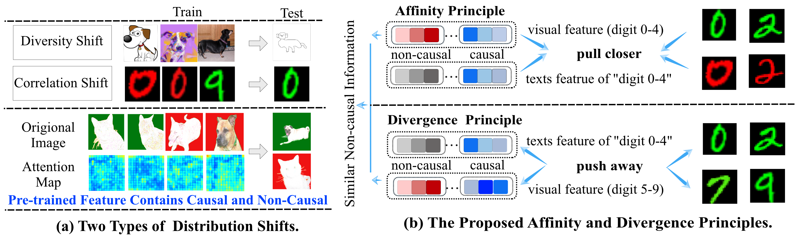
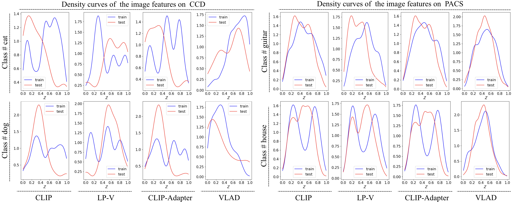

# VLAD: Vision-Language Alignment Learning Under Affinity and Divergence Principles for Few-Shot Out-of-Distribution Generalization

Official implementation of [**Vision-Language Alignment Learning Under Affinity and Divergence Principles for Few-Shot Out-of-Distribution Generalization**](https://link.springer.com/article/10.1007/s11263-024-02036-4)

The paper has been accepted by IJCV 2024.

## Ads

Checkout our AAAI 2023 work [<u>Bayesian Cross-Modal Alignmnet Learning for Few-Shot Out-of-Distribution Generalization</u>]( https://ojs.aaai.org/index.php/AAAI/article/view/26355) ,

ICML2024 work [CRoFT: Robust Fine-Tuning with Concurrent Optimization for OOD Generalization and Open-Set OOD Detection (openreview.net)](https://openreview.net/pdf?id=xFDJBzPhci)  if you are interested!

## Abstract

Builting upon the large-scale pre-trained vision-language foundation model CLIP, we leverage frozen language embeddings as invariant anchors to protect against distribution shifts, while using adapter layers to fine-tune pre-trained visual features for improved vision-language alignment. Besides, we introduce affinity and divergence principles to further mitigate overfitting during the vision-language aligning process by increasing class discrimination and suppressing non-causal features. More importantly, we offer theoretical evidence highlighting the superiority of general language knowledge in achieving more robust OOD generalization performance. The tighter upper bound of the OOD generalization errors by the proposed regularization loss is also shown in theoretical analysis. Our approach is substantiated by extensive experiments and ablation studies on diverse datasets, validating our theoretical findings. 

## Pipeline



Fig (a) Examples of the two-type of distribution shifts. The training examples have different correlations, such as color, or have different image styles from the test data, corresponding to the correlation shift and diversity shift, respectively. According to our empirical finding (in Sect. 4.1) that both foreground and background information exist in pretrained image features, fine-tuning may lead DNNs sensitive to spurious correlations. (b) Illustration of the affinity and divergence principles. The visual feature adapter is required to refine the crucial information in the visual feature by focusing on causal features and paying little attention to the common parts of different classes. And thus it can increase class discrimination and meanwhile suppress non-causal features. For example, it would pull small digits with different colors together, but push digits with the same color from different classes away.

## How to Install 

This code is built on top of the awesome [Dassl](https://github.com/KaiyangZhou/Dassl.pytorch) and [CoOp]([KaiyangZhou/CoOp: Prompt Learning for Vision-Language Models (IJCV'22, CVPR'22) (github.com)](https://github.com/KaiyangZhou/CoOp))., run `pip install -r requirements.txt` under `VLAD/CoOp/` to install the required packages.

```python
git clone https://github.com/LinLLLL/VLAD
cd VLAD-main/CoOp

conda create -n vlad python=3.9
conda activate vlad

pip install -r requirements.txt

# Install the according versions of torch and torchvision
conda install pytorch torchvision cudatoolkit
```

## Datasets

Follow [DATASET.md](https://github.com/gaopengcuhk/Tip-Adapter/blob/main/DATASET.md) to install ImageNet and other 10 datasets referring to CoOp.

For the OOD datasets, such as PACS, VLCS, CelebA, and ColoredMNIST, are publicly available but need to be downloaded manually. Please refer this [instruction]([OoD-Bench/data/README.md at main · m-Just/OoD-Bench (github.com)](https://github.com/m-Just/OoD-Bench/blob/main/data/README.md)) for OOD datasets download.

The ColoredCatsDogs dataset (CCD for short) has spurious correlations with the background color (green or red), constructed in a similar principle as ColoredMNIST but with images of cats and dogs disturbed by Gaussian noise to increase complexity. The CCD dataset can be downloaded [here](https://pan.baidu.com/s/1za8Cp8PJyWWStTj88D4jGA?pwd=vjgf).

Please make sure that the directory structure of each dataset is arranged as follows:

#### PACS

```
PACS
├── images
    ├── art_painting
    ├── cartoon
    ├── photo
    └── sketch
├── test_on_art_painting.json
├── test_on_cartoon.json
├── test_on_photo.json
└── test_on_sketch.json
```

#### VLCS

```python
VLCS
├── images
    ├── CALTECH
    ├── LABELME
    ├── PASCAL
    └── SUN
├── test_on_caltech.json
├── test_on_labelme.json
├── test_on_pascal.json
└── test_on_sun.json
```

#### CelebA

```python
CelebA
├── img_align_celeba
└── blond_split
    ├── tr_env1_df.pickle
    ├── tr_env2_df.pickle
    └── te_env_df.pickle
```

#### ColoredMNIST

```python
ColoredMNIST
├── train1
├── train2
├── val
└── test
```

#### ColoredCatsDogs

```python
ColoredCatsDogs
├── train_1
├── train_2
├── val
├── test
└── ColoredCatsDogs.json
```

## How to Run 🚀

We provide the running scripts in `CoOp/scripts`. Make sure you change the path in `DATA` and run the commands under `CoOp/scripts/VLAD`.  For example: 

▶️ For training VLAD on the OOD datasets:

```shell
cd CoOp/scripts/VLAD
python run_vlad.py
```

▶️ For training CLIP-Adapter on the OOD datasets:

```shell
cd CoOp/scripts/CLIP_Adapter
python run_adapter.py
```

▶️ For training Linear Probing the Single-Modality Vision Model (LP-V)on the OOD datasets:

```shell
cd CoOp/scripts/LinearProjection
python run_lp.py  # light-weight fine-tuning 
```

▶️ For training Full Fine-Tuning Single-Modality Vision Model on the OOD datasets:

```shell
cd CoOp/scripts/LinearProjection_FT
python run_ft.py  # full fine-tuning
```

▶️ During the training of LP-FT (liner projection and then full fine-tuning) on the OOD datasets, a two-stage training process is employed. Initially, a LP model should be learned and utilized as the weight initialization for the subsequent full fine-tuning step.

```shell
cd CoOp/scripts/LinearProjection
python run_lp.py  # light-weight fine-tuning
```

Then designate  the weight initial path for full fine-tuning step, e.g., `init_weights_path = outputs/ColoredCatsDogs/ColoredCatsDogs.json/LinearProjection/seed1/16/classifier/model-best.pth.tar ` in  `ft_ccd/sh`, and run full fine-tuning:

```shell
python run_ft.py  # full fine-tuning
```

**▶︎ Results on RN50, ViT-B/16, and ViT-L-14:** 

We probide the code for three backbone RN50, ViT-B/16, and ViT-L-14.

The pre-trained model ViT-L-14.pt are downloaded in advance from https://openaipublic.azureedge.net/clip/models/b8cca3fd41ae0c99ba7e8951adf17d267cdb84cd88be6f7c2e0eca1737a03836/ViT-L-14 .pt and placed at `Models/ViT-L-14.pt` for convenience.

**▶︎ Visualization:** 

**✅ Visualization on distribution of the adapted features**

1️⃣ Please ensure that you have specified the file path (e.g., `DATA` and `DIR ` in `CoOp/scripts/VLAD/test_pacs.sh` and `VLAD/CoOp/scripts/VLAD/test_ccd.sh`) and use  **`VIZ.FeatDiv True`**.

2️⃣  Run `bash test_ccd.sh` or  `bash test_pacs.sh` under  ``CoOp/scripts/VLAD` to visualize the density curves of the pre-trained image features or adapted image features. 



**✅ Visualization on Grad_CAM**

1️⃣ Please ensure that you have specified the file path (e.g., `output_dir` and `output_dir1` in `VLAD/CoOp/gradcam.py`) for saving Grad_CAM results.

2️⃣ Please ensure that you have specified the file path (e.g., `DATA` and `DIR ` in `CoOp/scripts/VLAD/test_ccd.sh`) and use  **`VIZ.GRADCAM True`**.

3️⃣ Then you can run `bash test_ccd.sh` or  `bash test_pacs.sh` under  `CoOp/scripts/VLAD`.

**▶︎ Collect Results:** Run `python collect_result.py` under `VLAD/CoOp/` to get the final results of VLAD after hyperparameters search based on the specifc validation protocol.

## Acknowledgement

This repo benefits from [CLIP](https://github.com/openai/CLIP), [CoOp](https://github.com/KaiyangZhou/Dassl.pytorch) [CoCoOp]([KaiyangZhou/CoOp: Prompt Learning for Vision-Language Models (IJCV'22, CVPR'22) (github.com)](https://github.com/KaiyangZhou/CoOp)), [Tip-Adapter-F]([gaopengcuhk/Tip-Adapter (github.com)](https://github.com/gaopengcuhk/Tip-Adapter)), [DPLCLIP]([shogi880/DPLCLIP (github.com)](https://github.com/shogi880/DPLCLIP)), [CLIP-Adapter](https://github.com/gaopengcuhk/CLIP-Adapter) and the OOD generalization benchmark [OoD-Bench]([ynysjtu/ood_bench (github.com)](https://github.com/ynysjtu/ood_bench)). Thanks for their wonderful works.

# Citation

If you use this code in your research, please kindly cite the following papers:

```
@article{zhu2024vision,
  title={Vision-Language Alignment Learning Under Affinity and Divergence Principles for Few-Shot Out-of-Distribution Generalization},
  author={Zhu, Lin and Yin, Weihan and Yang, Yiyao and Wu, Fan and Zeng, Zhaoyu and Gu, Qinying and Wang, Xinbing and Zhou, Chenghu and Ye, Nanyang},
  journal={International Journal of Computer Vision},
  pages={1--33},
  year={2024},
  publisher={Springer}
}

@inproceedings{zhu2023bayesian,
  title={Bayesian cross-modal alignment learning for few-shot out-of-distribution generalization},
  author={Zhu, Lin and Wang, Xinbing and Zhou, Chenghu and Ye, Nanyang},
  booktitle={Proceedings of the AAAI Conference on Artificial Intelligence},
  volume={37},
  number={9},
  pages={11461--11469},
  year={2023}
}
```

## Contact ✉️

If you have any question about this project, please feel free to contact zhulin_sjtu@sjtu.edu.cn.

